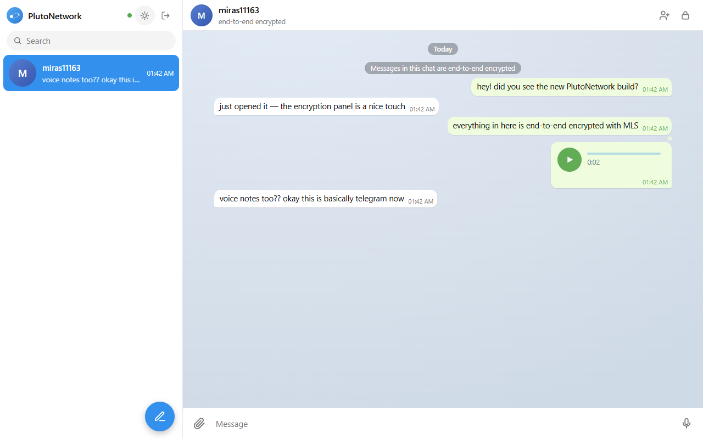

# PlutoNetwork

Open-source end-to-end encrypted messenger ("PN" for short). Clean, familiar chat with text, images, videos, voice notes and files, all fully encrypted on top of one shared Rust crypto core.

> ⚠️ **Status: working prototype.** The crypto engine works and the whole flow is covered by automated end-to-end tests, but nothing here has been audited. Do not trust it with real secrets yet.



## How it's built

The whole design philosophy: write the hard part (crypto + protocol) **once** in Rust, keep everything else thin.

| Layer | Choice | Why |
|-------|--------|-----|
| E2EE protocol | **MLS (RFC 9420)** via [OpenMLS](https://github.com/openmls/openmls) | IETF standard, forward secrecy + post-compromise security, group keys scale log(N) |
| Crypto core | **Rust** (`crates/plutonetwork-core`) | Same architecture Signal (libsignal) and Element (matrix-rust-sdk) ship in production |
| Web | Rust core compiled to **WASM** + vanilla JS chat UI | Crypto never reimplemented in JS |
| Relay server | **Elixir** (Bandit + Plug) | BEAM is the proven runtime for massive real-time messaging |
| Attachments | Client-side AES-256-GCM, ciphertext blob store | The Signal attachment model — the relay never sees media plaintext |
| Profile photos | Canvas re-encode (strips EXIF/GPS/all metadata), then encrypted like attachments | Key travels only inside MLS messages, so only your contacts can see your photo |
| Transport | WebSocket + plain HTTP | Boring and battle-tested |

The server is a **zero-knowledge relay**: it stores key packages (public), routes/queues ciphertext, and holds encrypted blobs and vaults it cannot open.

## How auth works

Your password never reaches the server. On sign-in it is stretched with PBKDF2-SHA256 (310k iterations, salted with your username) into 64 bytes, split in two:

- **authKey** (first half) — sent to the relay as your "password". The relay salts and hashes it *again* (PBKDF2, 100k) before storing. Compromising the relay database yields neither your real password nor your vault key.
- **vaultKey** (second half) — an AES-256-GCM key that **never leaves your device**. It seals the MLS engine state in IndexedDB and the history vault.

The **history vault** is your chats + messages, encrypted with the vaultKey and backed up to the relay. Sign in on a new device with the same password → the vault decrypts → your history comes back. MLS ratchets can't move between devices (by design — that's what makes forward secrecy work), so restored chats are read-only until a member re-adds you; fresh key packages are published automatically so that takes one click.

**Changing your password** (Settings → Change password) re-derives both keys: the relay verifies the old auth key before accepting the new one, then the client re-seals the MLS state and history vault with the new vault key, locally and on the relay. Knowing the current password preserves everything.

Honest tradeoffs of this model:
- Forgotten password = unreadable vault. There is no reset that preserves history.
- The relay binds usernames to key packages; a malicious relay could substitute keys (no safety-number verification yet).
- One active device per identity at a time.

## Repo layout

```
crates/
  plutonetwork-core/   # MLS engine — identity, groups, encrypt/decrypt, state export
  plutonetwork-wasm/   # wasm-bindgen bridge for the web client
server/                # Elixir relay — accounts, key packages, mailboxes, blobs, vaults
web/app/               # web client (no bundler, ES modules)
docs/                  # architecture notes + screenshots
```

## Quick start

```sh
# 1. crypto core tests
cargo test -p plutonetwork-core

# 2. build the wasm bundle (lands in web/app/pkg)
wasm-pack build crates/plutonetwork-wasm --target web --out-dir ../../web/app/pkg

# 3. relay (needs Elixir; or use the docker one-liner below)
cd server && mix deps.get && mix run --no-halt

# 3b. ...or with Docker
docker run --rm -v "$PWD/server:/app" -w /app -p 4000:4000 elixir:1.17-slim \
  sh -c "apt-get update -qq && apt-get install -y -qq ca-certificates >/dev/null && \
         mix local.hex --force && mix local.rebar --force && mix deps.get && mix run --no-halt"

# 4. serve the web client (any static server, from the repo root)
npx http-server . -p 8080
# open http://localhost:8080/web/app/index.html

# 5. relay integration tests (relay must be running)
cd server && node smoke.mjs
```

## Deploying

The whole app ships as **one container**: the relay serves the web client, so everything is same-origin (no CORS, no hardcoded URLs). `Dockerfile` builds the wasm core and the relay in one image.

**HTTPS is required in production.** Browsers only expose WebCrypto in secure contexts, and every key derivation and seal in this app runs on it. Any host that terminates TLS for you (Fly.io, Railway, Render, or a VPS behind Caddy) satisfies this.

```sh
# run the production image locally
docker compose up --build        # app on http://localhost:4000

# Fly.io (recommended: free-tier friendly, automatic HTTPS, persistent volume)
fly launch --no-deploy           # uses fly.toml; pick an app name + region
fly volumes create pluto_data --size 1
fly deploy

# any VPS: docker compose up -d, then put Caddy/nginx with TLS in front of :4000
```

Durable state lives in `/app/data` (accounts, queued ciphertext, blobs, vaults). Mount a volume there or messages queued for offline users vanish on redeploy. Scale-wise this is a single-node design (DETS + local disk): perfect for a friend group, not for a million users.

## Roadmap

- [x] Rust core wrapping OpenMLS + WASM bridge
- [x] Elixir relay — key package directory, ciphertext queue, WebSocket fan-out
- [x] Encrypted local persistence + encrypted server history backup
- [x] Polished chat UI with images, videos, voice notes, files
- [ ] Safety numbers / key verification UI
- [ ] Member removal + multi-device
- [ ] iOS/Android via UniFFI bindings
- [ ] Security audit before anyone uses this for real

## License

AGPL-3.0, see [LICENSE](LICENSE). Server and clients stay open, forks stay open.
